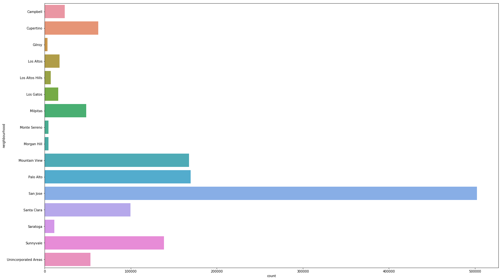
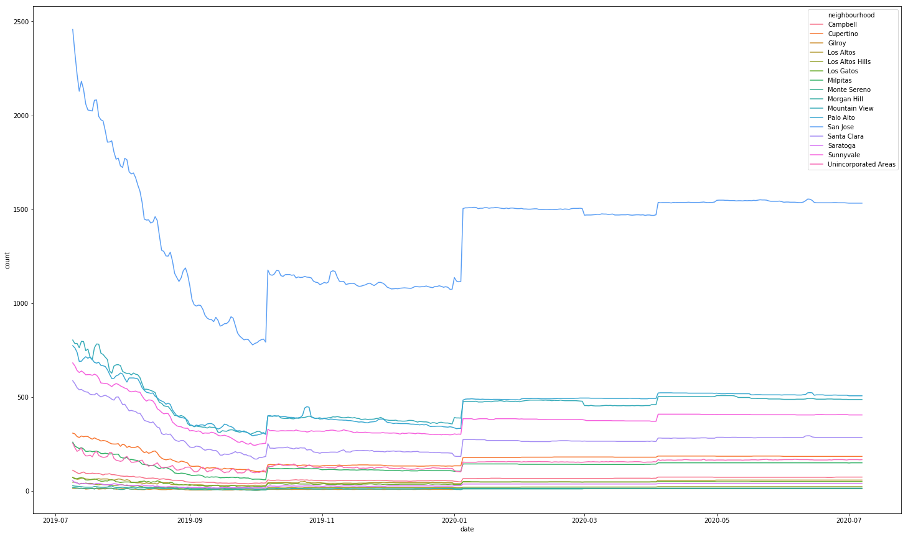
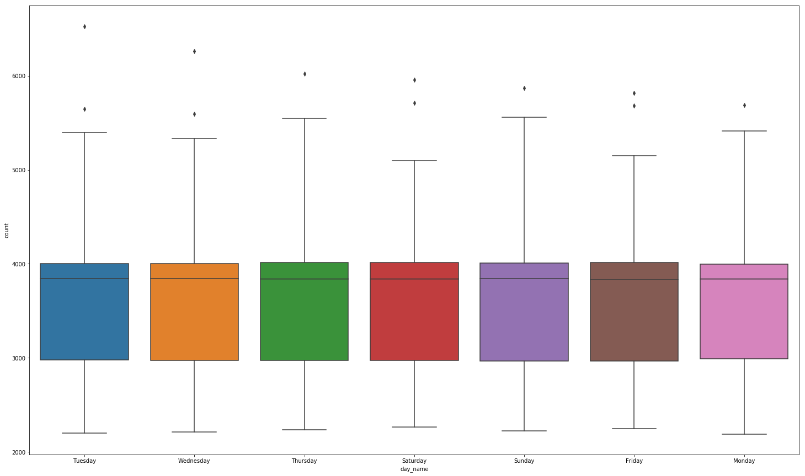
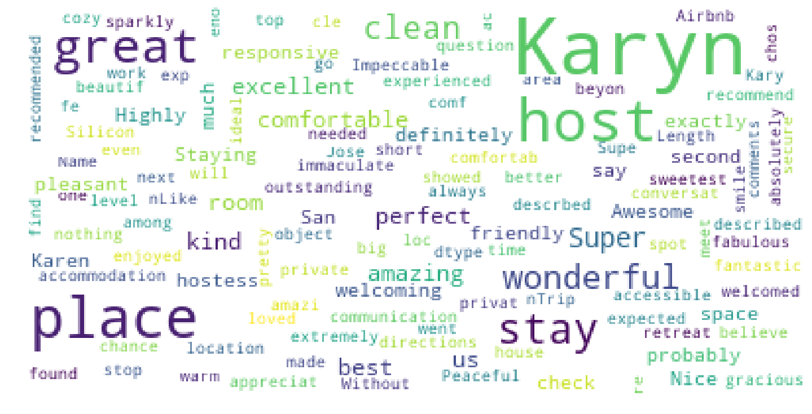
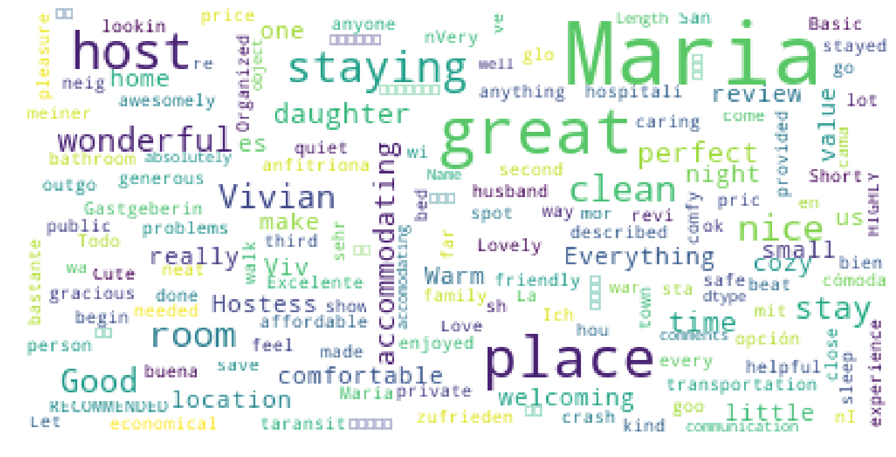

## Introduction

There are many owners who are offering lodging services via Airbnb, but few get good ratings and revenues. I wanted to know the factors, so that I can offer the services and maximize revenue.

### Part I: What are the most popular areas in Santa Clara for rentals and when (weekends, days etc)?

Here you can see more bookings happen in San Jose, may be because there are more companies around. Next are Mountain View and Palo Alto. May be its a good idea to offer lodging services in San Jose and next preferences are Mountain View and Palo Alto.

From the below image, we can see the bookings increase every summer, gradually reducing until October 2019, remains same until January 2020. Again the bookings start increasing. We could the same pattern across all the neighborhoods of Santa Clara

### Part II: On which days (weekdays or on weekends) the demand is more?

Bookings are same across all days in a week. But more number of bookings are on Thursday and Sunday. Interesting to see that bookings happen on all days. May be we could expect the tourists or accomodation for employees etc.,

### Part III: Analyzing the reviews of the listings

Generally people tend to opt for listings, which are good. Lets see why people go for same listing. From the below images, we can see people like great stay at listing, which are accessible, clean, great service etc.,

### Part IV: Whats factors contribute to the better rating?

People usually see the reviews of the listings and then book, as we see in our model that increase in review scores accuracy, value, cleanliness, communication, checkin increases the review ratings.

Also, review might increase when host is superhost. To be a superhost, need to be good in all aspects (service, cleanliness etc)

In order to get reviews, service should be better for the value of the listing.

### Conclusion

In this article, we looked at AirBnB data from Santa Clara to understand three areas of interest: popular areas, popular timing, popular days, analyzing reviews and listing review ratings.

There were some useful insights found at each part of our questions, but equally there were some questions left unanswered. Three high level takeaways include:

Santa Clara listings appear to have more bookings, which may be because of the companies around (where employees were given accomodation for few days etc) or traveling destinations etc. There are more listings which are booked in San Jose, way higher than other areas.

Bookings for the homes, generally happning at the end of the week (Thursday) and start of the week (Sunday Night for instance)

In Santa Clara, visitors tend to care about availability to the city, great lodging services, beautiful location, staff freindliness. Its important to get good reviews.
